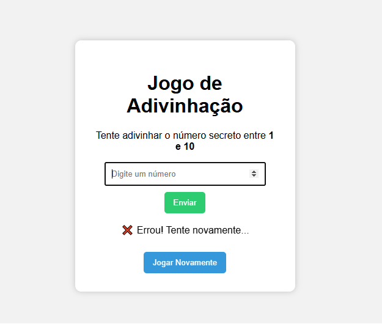

🎯 Jogo de Adivinhação (1 a 10)

Este é um projeto simples em HTML, CSS e JavaScript, onde o usuário deve tentar adivinhar um número secreto entre 1 e 10.
O jogo informa se o palpite está correto ou errado e permite reiniciar a partida.

🖼️ Pré-visualização do Jogo

📌 Funcionalidades

🔢 Gera automaticamente um número secreto entre 1 e 10

🧠 Usuário digita um número e recebe:

✔️ Mensagem de acerto

❌ Mensagem de erro

🔄 Botão para jogar novamente

💡 Validação para números fora do intervalo permitido

🎨 Interface simples e amigável

🧠 Como o jogo funciona

O JavaScript gera um número aleatório entre 1 e 10.

O jogador digita um número no campo.

Ao clicar em Enviar, o programa verifica:

Se está fora do intervalo → avisa o jogador

Se acertou → mostra mensagem de sucesso

Se errou → mostra mensagem de tentativa

Em Jogar Novamente, o número secreto é recriado e a interface reinicia.

📁 Estrutura do Projeto
📦 jogo-adivinhacao  
├── index.html  
├── style.css  
├── script.js 
└── TELAJOGO.png 

🛠️ Tecnologias Usadas

HTML5

CSS3

JavaScript (ES6)